# Madeleine

Madeleine is a simple and powerful app to record your memories in text, image or video form and see the emotions attached to them.

# Table of Contents

1. [Features](#zap-features)
   1. [Journaling](#memo-journaling)
   1. [Filtering](#doughnut-filtering)
   1. [Insights](#bulb-insights)
1. [Team](#busts_in_silhouette-team)
1. [How It Works](#nut_and_bolt-how-it-works)
   1. [Application Architecture](#european_post_office-application-architecture)
   1. [Posting a Moment](#envelope-posting-a-moment)
   1. [Processing a Moment](#factory-processing-a-moment)
   1. [Analyzing a Moment](#mag-analyzing-a-moment)
1. [Tech Stack](#package-tech-stack)
    1. [Front-End](#performing_arts-front-end)
    1. [Back-End](#factory-back-end)
    1. [Development Tools](#hammer-development-tools)
    1. [Technologies](#computer-technologies)
    1. [APIs](#information_source-apis)
1. [Development](#rocket-development)
    1. [Installing System Dependencies](#installing-system-dependencies)
    1. [Installing Project Dependencies](#installing-project-dependencies)
    1. [App Configuration](#app-configuration)
    1. [Database Initialization](#database-initialization)
    1. [Database Creation](#database-creation)
    1. [Run Migrations & Data Seeds](#run-migrations-and-data-seeds)
    1. [Running the App](#running-the-app)
1. [Contributing](#speech_balloon-contributing)

## :zap: Features

### :memo: Journaling

<p align="center">
  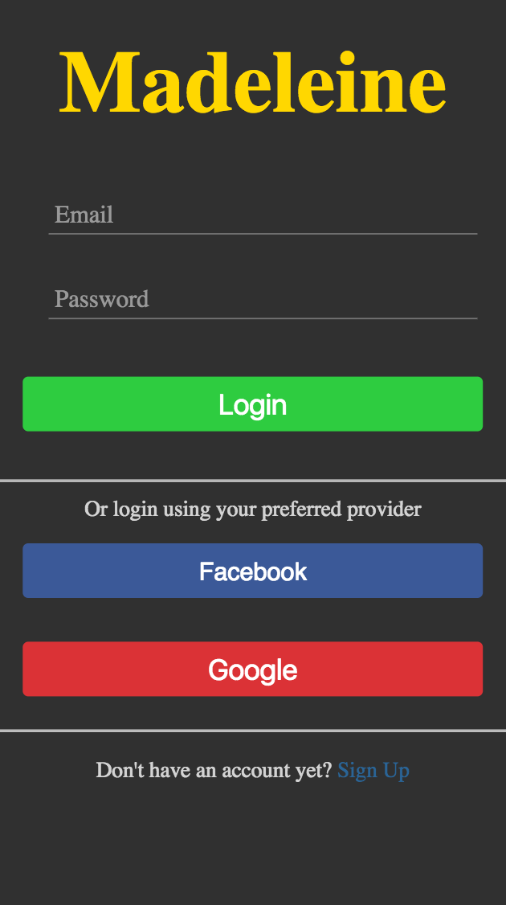
</p>

1. Upon landing on the home screen, you will be prompted to sign in using Facebook, Google or to sign up using your email address.

<p align="center">
  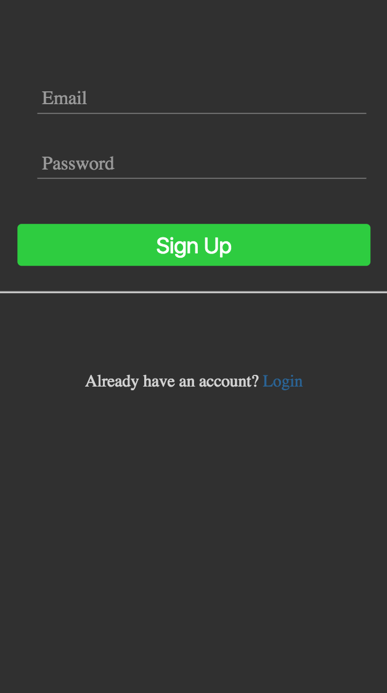
</p>

2. If you choose to sign up using your email address, you will be prompted on this screen to do so.

<p align="center">
  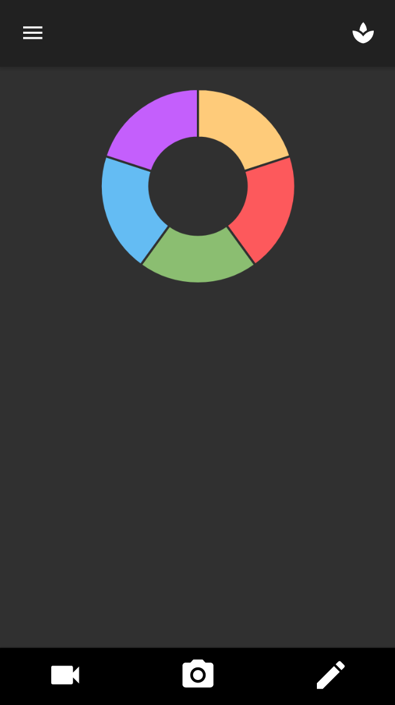
</p>

3. After logging in/signing up, you will land on the home screen, where you can view each of your journal entries and a summary distribution of your entries displayed as a donut chart.
4. You can choose to create a new journal entry, which we call "moments", by clicking on the menu bar at the bottom of the screen - your choices are to start with either a text entry, a photo or a video.

<p align="center">
  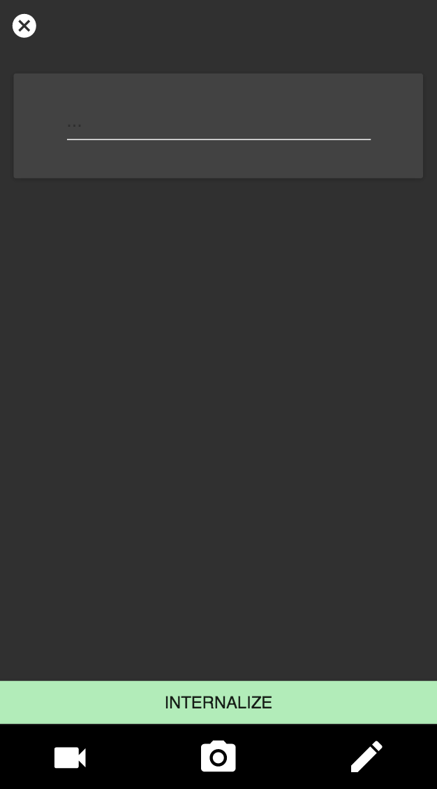
</p>

5. If you chose to make a text entry, this wll take you to a preview page where you can do so.

<p align="center">
  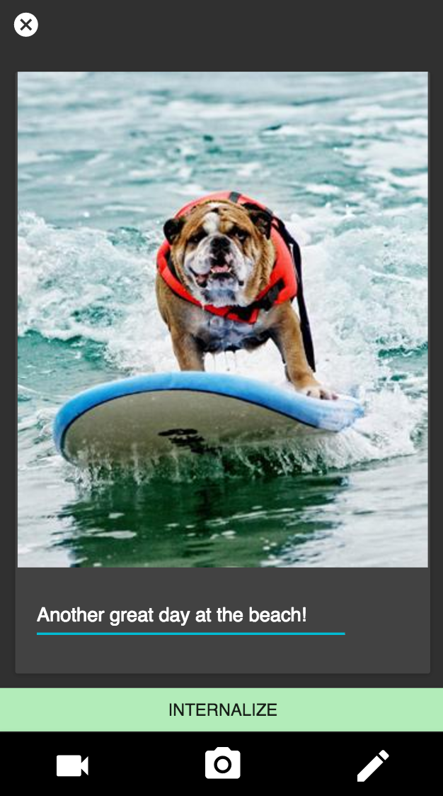
</p>

6. Each moment can consist of any combination of text, photo and video, so you may choose to add any combination of these for a particular moment.

7. Once you have completed your moment, click on 'internalize' to submit it.

<p align="center">
  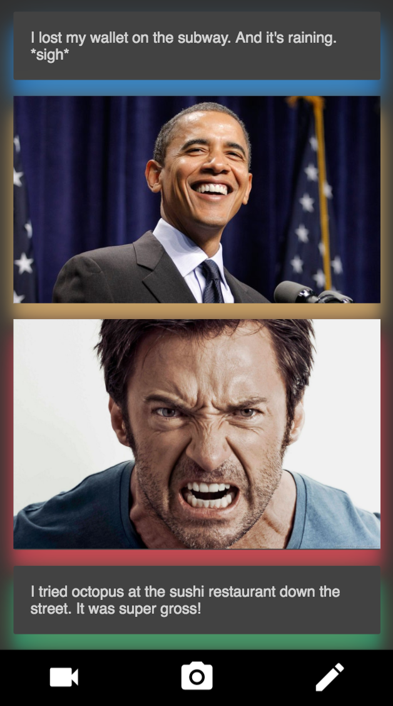
</p>

7. You can then scroll through your moments and see the sentiments displayed as colored shadows.

### :doughnut: Filtering

<p align="center">
  
</p>

1. You can filter your list of moments by sentiment. You can do this by clicking on the section of the donut chart corresponding with the emotion you wish to filter for.
2. Click anywhere else around the donut to reset your display to all your moments.

### :bulb: Insights

<p align="center">
  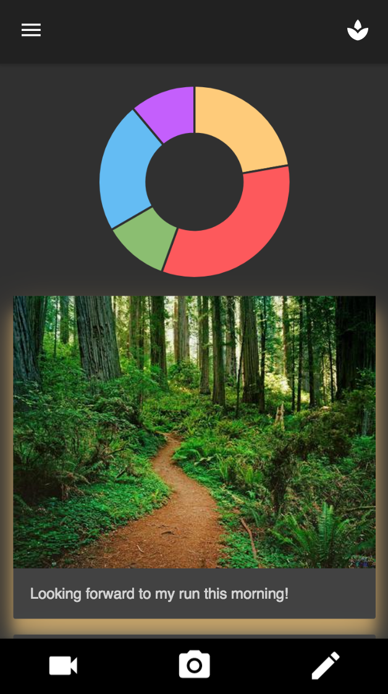
</p>

1. Clicking on the tree icon in the upper right corner will take you to a visualization of your emotional history, represented as a tree.

<p align="center">
  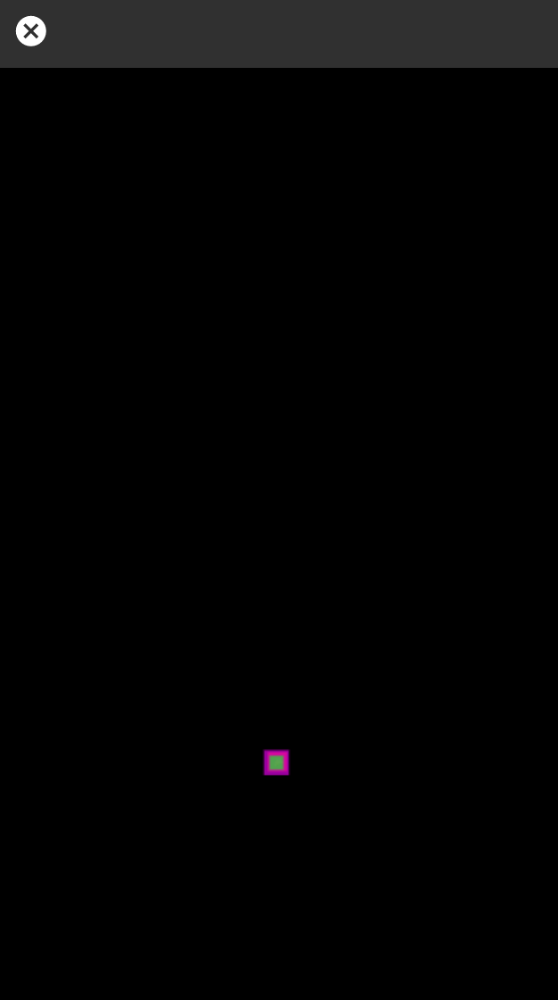
</p>

2. The rendering of the tree depends on the number of moments that you've recorded and the emotions associated with them. The height varies with the number of moments recorded and the colors of the leaves correspond directly with the each moment's recorded emotions. So initially, you will see a tiny 'seed' because you won't have any emotional history to display.

<p align="center">
  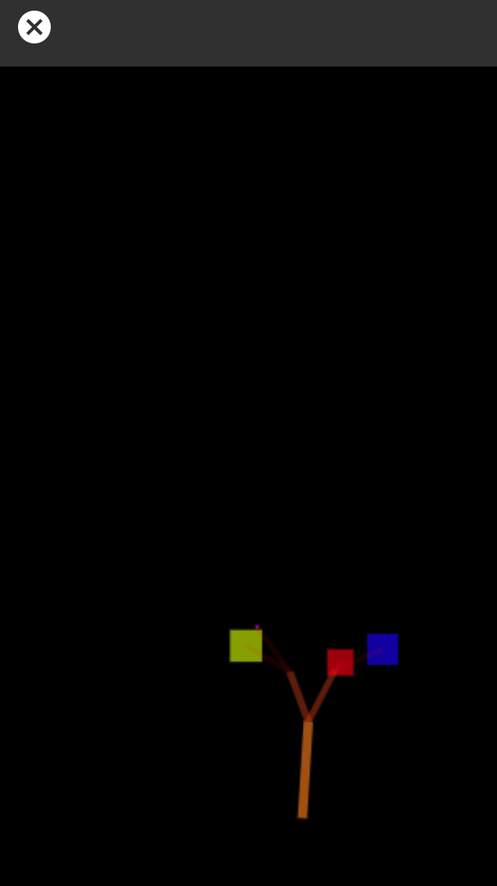
</p>

3. As you add more moments, the tree will grow and the leaves will fill out with the colors of the sentiments you've recorded.

<p align="center">
  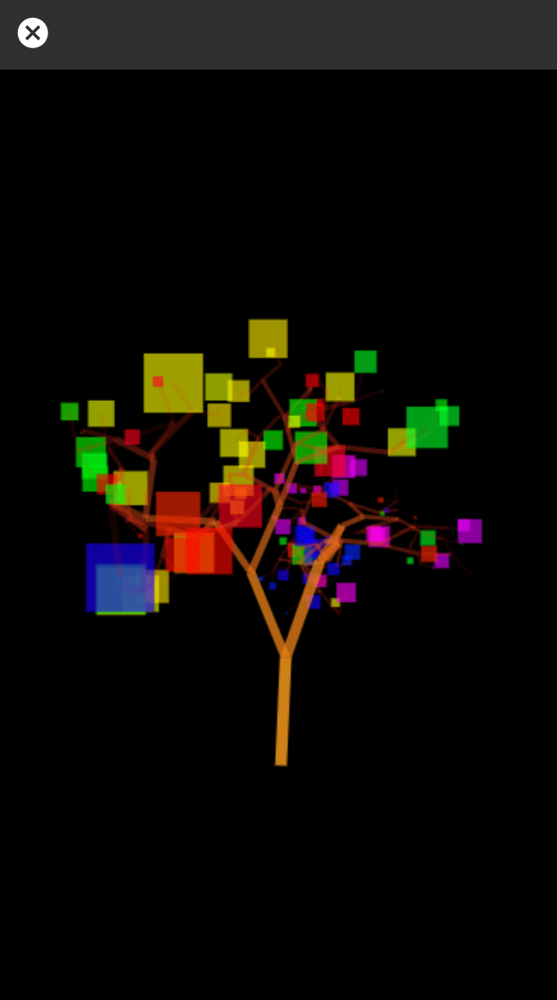
</p>

4. Here's an example of a tree with 125 moments!

5. Clicking on the Tree will cause it to rerender - as there is some stochastic noise in its construction, no two renderings will be exactly alike.
6. Clicking on the Cancel button in the top left corner will return you to your home page.

## :busts_in_silhouette: Team

 - [Azmeer Salleh](https://github.com/azmeer)
 - [Alexander Poet](https://github.com/AlexanderPoet)
 - [Tyler Pate](https://github.com/TylerPate)
 - [Gunpreet Singh](https://github.com/kllrjatt)

We're full-stack engineers with a passion for making fast, elegant, and scalable web applications. Get in touch - we'd love to hear from you. Better yet, submit a pull request! 

## :nut_and_bolt: How it Works

### :european_post_office: Application Architecture

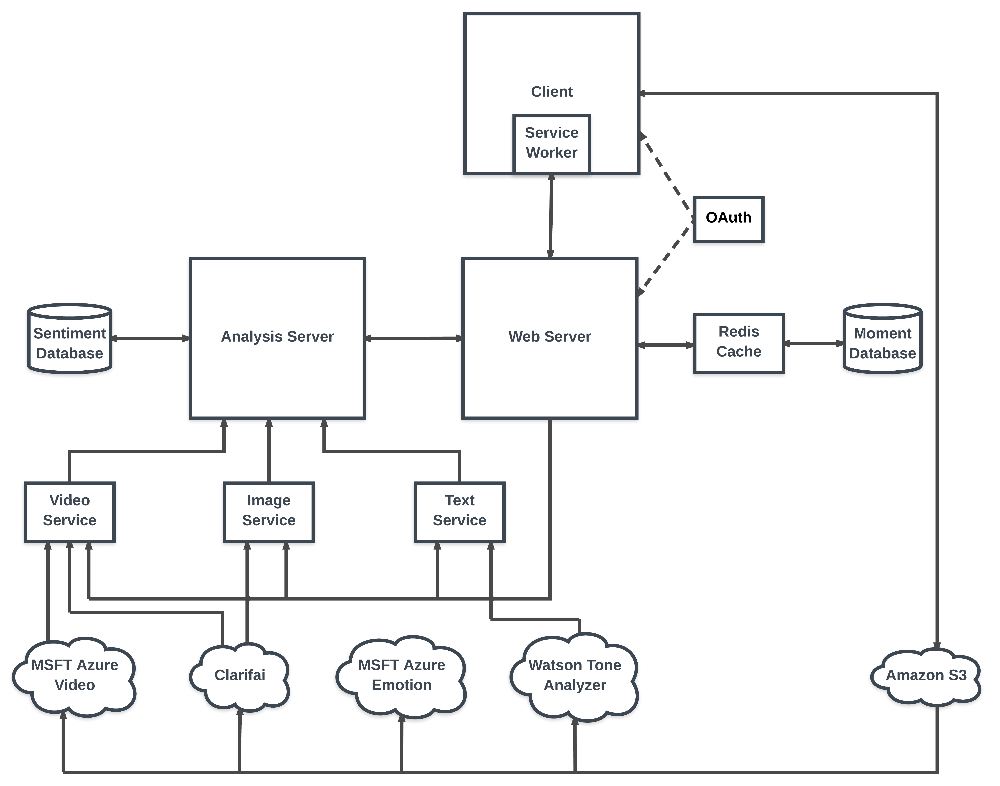

### :envelope: Posting a Moment
Once a moment is recorded on the client, it requests a pre-signed S3 URI from the Web server for each piece of media that needs to be stored. The Web server records this moment in the moment database before generating and returning these URIs to the client. Once the client has successfully stored the media, it notifies the web server that the media is ready to be analyzed.

### :factory: Processing a Moment
Upon being notified by the client that the media has been stored, the web server dispatches requests to the media processing servers to process the media files. Each media processing server will call one or more of Watson's Tone Analysis API, Microsoft's Azure Vision API, Microsoft's Azure Video API, and Clarifai's Image/Video tagging APIs. Each media processing server will then normalize the API call results and forward them to the Analysis server.

### :mag: Analyzing a Moment
The Analysis server will store the analysis and tagging information in the sentiment database. If it determines that all pieces of media for a given moment have been processed, it will iterate over the results and determine the predominant emotion associated with that moment and post this aggregate result to the web server, which then updates the moment database to reflect that analysis.

## :package: Tech Stack

### :performing_arts: Front-End

1. React
2. React Router
3. Material UI
4. Charts JS
5. Canvas
6. Bluebird Promises
7. Axios
8. IndexedDB

### :factory: Back-End

1. Node
2. Express
3. PostgreSQL
4. Bookshelf
5. MongoDB
6. MongooseJS
7. Redis
8. Knex
9. Axios
10. Passport

### :hammer: Development Tools

1. Webpack
2. Chai
3. ESLint
4. Pomander 
5. React PropTypes
6. Yarn
7. Grunt
8. Morgan

## :computer: Technologies

- Node 6.11.1
- Redis 4.0
- Postgresql 9.6.3
- MongoDB 3.4.6
- AWS S3
- See APIs below

You can use either local or hosted versions of Redis, Postgres or MongoDB.

## :information_source: APIs
Madeleine uses third-party services to power its analytics and storage features. To use the application, you'll need to generate API keys for the following services:

- [IBM Watson Tone Analysis API](https://www.ibm.com/watson/services/tone-analyzer/)
- [Microsoft Azure Emotion Analysis API](https://azure.microsoft.com/en-us/services/cognitive-services/emotion/)
- [Microsoft Azure Vision Analysis API](https://azure.microsoft.com/en-us/services/cognitive-services/computer-vision/)
- [Clarifai](https://www.clarifai.com/)

## :rocket: Development

This application also depends on the Mementologists Millefeuille process and analysis servers which can be found [here](https://github.com/mementologists/millefeuille). 

Please ensure that the following are running before starting up the Madeleine server:
1. The Millefeuille Text Processing Server
1. The Millefeuille Image Processing Server
1. The Millefeuille Video Processing Server
1. The Millefeuille Analysis Server
1. Postgres
1. Redis
1. MongoDB

### Installing System Dependencies

```
brew install yarn
brew install redis
brew install postgresql
```

### Installing Project Dependencies

From within the root directory, execute the following commands:

```
yarn global add grunt-cli knex
yarn install
```
### App Configuration

Please see `config/default.json` for a list of the necessary environment variables needed for the app to run correctly. 

See https://www.npmjs.com/package/config
And https://github.com/lorenwest/node-config/wiki/Environment-Variables#custom-environment-variables

### Database Initialization

IMPORTANT: ensure `postgres` is running before performing these steps.
You may also need to execute the following command to create a postgres user in your Postgres database with the needed permissions:

```
createuser -d -l -e postgres
```

### Database Creation:

Use grunt to create a new database for your development and test environments:

Development envronment:

```
grunt pgcreatedb:default
```

Other environments, specify like so: `NODE_ENV=[environment] grunt pgcreatedb:default`

### Run Migrations and Data Seeds

In terminal, from the root directory:

To migrate to the latest version, run:

```
knex migrate:latest --env NODE_ENV
```

To rollback a version, run:

```
knex migrate:rollback --env NODE_ENV
```

To populate the database with seed data, run:

```
knex seed:run --env NODE_ENV
```

Note: `--env NODE_ENV` may be omitted for development. For example, `knex migrate:latest` will run all migrations in the development environment, while `knex migrate:latest --env test` will migrate in the test environment.

### Running the App

To run webpack build:

```
yarn run build
```

To run the Madeleine web server:

```
yarn run start
```

To run tests:

```
yarn run test
```

To run your redis server for the session store

```
redis-server
```

## :speech_balloon: Contributing
 
We keep track of features, bugs, ui fixes, and other tickets using **Github Issues**. Check out [this page](https://github.com/mementologists/madeleine/issues) for a list of open issues. Refer to [CONTRIBUTING.md](./docs/CONTRIBUTING.md) for contribution guidelines.

Our application was written in ES6 (ECMAScript 2015) syntax and follows the [Airbnb Style Guide](https://github.com/airbnb/javascript).
